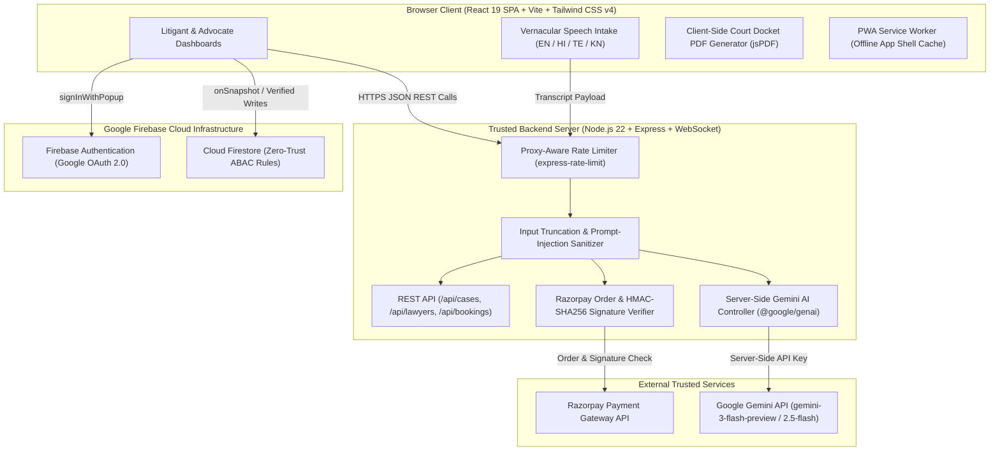

# ⚖️ JusticeBridge Legal Engine

**JusticeBridge** is a full-stack Indian Legal-Tech platform engineered to bridge the gap between citizens (litigants) and Bar Council–verified legal advocates. Designed around India's judicial workflow and modern statutory frameworks—including the **Bharatiya Nyaya Sanhita (BNS), Bharatiya Nagarik Suraksha Sanhita (BNSS), and Bharatiya Sakshya Adhiniyam (BSA), 2023** alongside legacy **IPC, CrPC, and IEA** statutes—JusticeBridge reduces procedural delays through vernacular voice-to-petition intake, real-time case tracking, cryptographic document integrity, and server-side AI legal intelligence.

---

## 🌐 Live Deployments

- **Development Environment:** [https://ais-dev-2ygeqzn4xbgemovtatd7wg-621467385062.asia-southeast1.run.app](https://ais-dev-2ygeqzn4xbgemovtatd7wg-621467385062.asia-southeast1.run.app)
- **Shared / Preview Environment:** [https://ais-pre-2ygeqzn4xbgemovtatd7wg-621467385062.asia-southeast1.run.app](https://ais-pre-2ygeqzn4xbgemovtatd7wg-621467385062.asia-southeast1.run.app)

---

## ✨ Core Features & Capabilities

| Module | Key Capabilities | Technical Implementation |
| :--- | :--- | :--- |
| **1. Verified Advocate Directory & Booking** | Discover advocates by specialization, court jurisdiction, Bar Council registration, languages, and fee structure; book consultations with instant retainer receipts. | Role-verified profiles, Bar Council ID validation workflow, and **Razorpay** order creation + **HMAC-SHA256** signature verification. |
| **2. Vernacular Voice-Enabled Case Filer** | Citizens narrate grievances in **English, Hindi (हिन्दी), Telugu (తెలుగు), or Kannada (ಕನ್ನಡ)**; automatically drafts structured court petitions with CNR numbers. | Web Speech API intake + server-side **Gemini AI** structured JSON extraction (`title`, `caseType`, `legalSections`, `reliefSought`, and native-script audio summary). |
| **3. AI Legal Intelligence & Document Analyzer** | Statutory mapping across **BNS/BNSS/BSA (2023)** and **IPC/CrPC/IEA**, case delay-risk auditing, and legal notice/contract analysis. | Server-side `@google/genai` proxy with multi-model fallback (`gemini-3-flash-preview` → `gemini-2.5-flash`) and deterministic statutory fallback engine. |
| **4. Isolated Case Management & CNR Tracker** | End-to-end litigation workspace tracking e-Courts CNR numbers, bench assignments, hearing timelines, delay-risk scores, and PDF case exports. | Strict role/ownership filtering (`clientId` / `assignedLawyerId`), `jsPDF` + `jspdf-autotable` court docket generation. |
| **5. Cybercrime & Emergency Incident Portal** | Secure reporting workflow for online harassment, financial fraud, identity theft, and cyberstalking with digital evidence attachments. | Structured incident categorization, severity triage, and SHA-256 evidence metadata hashing. |
| **6. Hearing Calendar & Deadline Tracker** | Interactive schedule of upcoming court hearings, filing scrutiny dates, virtual chamber links, and advocate consultations. | Real-time state synchronization and automated 10-day initial scrutiny docket scheduling for newly filed petitions. |
| **7. Progressive Web App (PWA) & Offline Shell** | Installable on Android, iOS, and desktop with offline application shell caching and Android Trusted Web Activity (TWA) asset links. | Custom Service Worker (`public/sw.js`), Web App Manifest (`manifest.json`), and Digital Asset Links (`/.well-known/assetlinks.json`). |

---

## 🏗️ System Architecture & Execution Boundaries

JusticeBridge enforces a strict separation between **untrusted browser client operations** and **trusted server-side execution**. Sensitive API keys, payment verification secrets, and AI prompt sanitization execute exclusively inside the Node.js/Express server runtime.



### Client vs. Server Responsibility Matrix

| Operation | Execution Layer | Why |
| :--- | :--- | :--- |
| **Google OAuth Sign-In & Session State** | Client SDK + Firebase Auth | Uses `signInWithPopup` with verified Google identity tokens (`request.auth`). |
| **Advocate Verification Queue (`verificationRequests`)** | Cloud Firestore + Security Rules | Enforces attribute-based read/update locks directly at the database layer. |
| **Gemini AI Legal Analysis & Voice Petition Parsing** | **Server-Side Only** (`server.ts`) | Prevents `GEMINI_API_KEY` exposure in browser bundles, enforces rate limits, and sanitizes prompt inputs. |
| **Razorpay Order Creation & Payment Verification** | **Server-Side Only** (`server.ts`) | Protects `RAZORPAY_KEY_SECRET` and performs constant-time `crypto.createHmac('sha256', ...)` verification. |
| **Static Asset & SPA Routing** | Express Server + Service Worker | Serves compiled `dist/` bundle in production with `no-cache` headers on `index.html` and `sw.js`. |

---

## 🗄️ Data Model & Schema Specifications

### 1. Cloud Firestore Collections

#### `users/{userId}`
Stores authenticated user profiles and role assignments.
```json
{
  "id": "usr_client_101",
  "name": "Aarav Sharma",
  "email": "aarav.sharma@example.com",
  "role": "client",
  "phone": "+91-9876543210",
  "location": "New Delhi, DL",
  "createdAt": "2026-10-01T10:00:00.000Z"
}
```
*Allowed `role` values:* `'client' | 'lawyer' | 'team_member' | 'admin'`

#### `verificationRequests/{requestId}`
Stores Bar Council verification submissions from legal advocates awaiting review by authorized verification officers.
```json
{
  "id": "ver_req_9021",
  "uid": "usr_lawyer_402",
  "name": "Adv. Meera Nair",
  "email": "meera.nair@lawchambers.in",
  "barCouncilId": "BCD/4829/2018",
  "stateBarCouncil": "Bar Council of Delhi",
  "specialization": ["Constitutional Writs", "Cyber & IP Disputes"],
  "experienceYears": 8,
  "status": "pending",
  "submittedAt": "2026-10-08T14:22:00.000Z"
}
```
*Allowed `status` transitions:* `'pending'` → `'approved' | 'rejected'` (enforced by `firestore.rules`).

### 2. Core Application Entities (`src/types.ts` & `server.ts`)

#### `CaseMatter` (Litigation & Voice-Filed Petitions)
```json
{
  "id": "case_voice_1728440000",
  "caseNumber": "VOICE-PET/2026/482",
  "cnrNumber": "JB01-839201-2026",
  "title": "Litigation Petition: Unlawful Property Possession & Injunction",
  "caseType": "Civil & Property",
  "filingDate": "2026-10-09",
  "courtName": "High Court of Delhi (Commercial Division)",
  "jurisdiction": "District / High Court Jurisdiction",
  "bench": "Single Judge Roster Bench",
  "petitioner": "Aarav Sharma (Litigant Petitioner)",
  "respondent": "Opposing Party",
  "clientId": "usr_client_101",
  "assignedLawyerId": "law_1",
  "status": "Filing",
  "delayRiskScore": "Low",
  "estimatedDisposalDays": 120,
  "nextHearingDate": "2026-10-19",
  "hearings": [
    {
      "id": "h_v_1728440000",
      "hearingDate": "2026-10-19",
      "courtRoom": "Virtual Scrutiny Chamber / E-Filing Registry",
      "judgeName": "Registrar (Judicial)",
      "stage": "Filing Scrutiny & Advocate Assignment",
      "status": "Scheduled"
    }
  ],
  "documents": [
    {
      "id": "doc_v_1728440000",
      "title": "Voice-Assisted E-Filing Petition",
      "fileName": "Vernacular_Voice_Petition_1728440000.pdf",
      "fileType": "pdf",
      "fileSize": "2.8 MB",
      "fileCategory": "Petition",
      "isRestricted": true,
      "documentHash": "sha256:voice_8f92a1c4..."
    }
  ]
}
```

---

## 🔒 Verifiable Security & Privacy Controls

JusticeBridge implements multi-layered, verifiable security controls designed for sensitive legal workflows:

### 1. Zero-Trust Firestore Security Rules (`firestore.rules`)
- **Default Deny Catch-All:** All unmatched paths explicitly reject access (`match /{document=**} { allow read, write: if false; }`).
- **Attribute-Based Access Control (ABAC):** Verification records (`verificationRequests/{requestId}`) can only be created by authenticated users (`request.auth != null`) and read or updated exclusively by authorized verification personnel (`isAdmin() || isTeamMember()`).
- **State Transition Locking:** Team members are restricted to transitioning requests from `['pending', 'rejected']` to `['approved', 'rejected']`, preventing unauthorized privilege escalation.

### 2. PII Isolation & Ownership Filtering
- **Case & Docket Isolation:** The `/api/cases` and `/api/bookings` endpoints filter records based on the caller's role and identity (`clientId === userId` for clients; `assignedLawyerId === lawyerId` for advocates). Unauthenticated or cross-tenant requests cannot enumerate another litigant's private case files.
- **Public vs. Private Data Split:** Public directory endpoints (`/api/lawyers`) expose only professional advocate credentials (Bar Council registration, practice areas, consultation fees, court jurisdictions), isolating private litigant contact details and case narratives.

### 3. Evidence & Document Integrity
- **Cryptographic Document Hashing:** Every uploaded or voice-generated legal document record includes a deterministic `documentHash` (`sha256:...`) and `isRestricted` access flag to detect tampering and maintain chain-of-custody metadata.
- **Payload Size & Type Validation:** Document uploads and evidence descriptions enforce strict string-length boundaries (`maxLength`) and file-category allowlists (`'Petition' | 'Evidence' | 'Affidavit' | 'Court Order' | 'Identity Proof'`).

### 4. Server-Side AI Secret Protection & Prompt-Injection Defense
- **Zero Client Key Exposure:** `GEMINI_API_KEY` is read exclusively by `server.ts` via `process.env.GEMINI_API_KEY`. It is never prefixed with `VITE_` or bundled into client JavaScript.
- **Prompt Sanitization (`sanitizeForPrompt`):** All user-supplied text, document excerpts, and voice transcripts are stripped of control characters, delimiter-escaped (`<<<USER_LEGAL_QUERY>>>`), and truncated to strict character limits (`1,500–4,000` chars) before being sent to Gemini.
- **Resilient Multi-Model Fallback:** If the primary model (`gemini-3-flash-preview`) experiences rate limiting or transient unavailability, the server automatically falls back to `gemini-2.5-flash`, and subsequently to a deterministic BNS/IPC statutory analysis engine so users never experience unhandled 500 crashes.

### 5. Proxy-Aware Rate Limiting
- Configured with `app.set('trust proxy', 1)` for Google Cloud Run and Nginx load balancers.
- Enforces `express-rate-limit` across all API and static manifest routes (capped at 200 requests per 15-minute window per IP in production).

---

## 📡 REST API Reference

| Method | Endpoint | Auth / Access | Description |
| :--- | :--- | :--- | :--- |
| `GET` | `/health`, `/api/health` | Public | Cloud Run liveness & readiness probe returning `{ status: "ok", uptime, timestamp }`. |
| `POST` | `/api/auth/login` | Public | Authenticates or registers a user session and returns role-mapped profile metadata. |
| `GET` | `/api/lawyers` | Public | Returns Bar Council–verified advocates with optional specialization and search filters. |
| `GET` | `/api/cases` | Authenticated (`userId`, `role`) | Returns cases isolated to the requesting client or assigned legal advocate. |
| `POST` | `/api/cases` | Authenticated Client/Lawyer | Files a new legal case matter, assigns a CNR number, and schedules initial scrutiny hearing. |
| `POST` | `/api/cases/voice-parse` | Authenticated Client | Parses vernacular spoken testimony (EN/HI/TE/KN) via Gemini AI and auto-files a structured petition. |
| `POST` | `/api/cases/:id/documents` | Case Owner / Assigned Lawyer | Attaches a new case document with SHA-256 integrity hash metadata. |
| `GET` | `/api/bookings` | Authenticated (`userId`, `role`) | Lists consultation bookings for the authenticated client or advocate. |
| `POST` | `/api/bookings` | Authenticated Client | Books a legal consultation slot and generates an invoice record. |
| `POST` | `/api/payments/create-order` | Authenticated Client | Creates a Razorpay payment order (or simulated escrow order when keys are omitted in dev). |
| `POST` | `/api/payments/verify` | Authenticated Client | Verifies Razorpay payment signature using `HMAC-SHA256`. |
| `POST` | `/api/ai/chat` | Rate-Limited | Server-side AI legal assistant mapping queries to BNS 2023 / IPC / CrPC / CPC provisions. |
| `POST` | `/api/ai/analyze-document` | Rate-Limited | Analyzes legal notices, contracts, or FIRs for statutory risks, obligations, and deadlines. |
| `GET` | `/api/analytics` | Public | Returns live platform disposal metrics and delay-reduction benchmarks across case categories. |

---

## 🚀 Installation & Local Setup

### Prerequisites
- **Node.js:** `>= 22.0.0` (Node `v22.x` recommended for native TypeScript execution)
- **npm:** `>= 10.0.0`
- **Firebase Project:** Configured with **Authentication** (Google Sign-In provider enabled) and **Cloud Firestore**.

### 1. Clone the Repository & Install Dependencies
```bash
git clone <your-repository-url>
cd justicebridge
npm install
```

### 2. Configure Environment Variables
Copy `.env.example` to `.env` in the project root and populate your credentials:
```bash
cp .env.example .env
```

```ini
# .env
# Required for server-side AI legal intelligence & voice petition structuring
GEMINI_API_KEY=your_google_gemini_api_key_here

# Optional: Required for live Razorpay checkout (falls back to safe test escrow mode if omitted)
RAZORPAY_KEY_ID=your_razorpay_key_id
RAZORPAY_KEY_SECRET=your_razorpay_key_secret
```

### 3. Configure Firebase (`firebase-applet-config.json`)
Ensure `firebase-applet-config.json` in the root directory contains your Firebase Web App credentials:
```json
{
  "projectId": "your-firebase-project-id",
  "appId": "your-firebase-app-id",
  "apiKey": "your-firebase-web-api-key",
  "authDomain": "your-firebase-project-id.firebaseapp.com",
  "firestoreDatabaseId": "(default)",
  "storageBucket": "your-firebase-project-id.firebasestorage.app",
  "messagingSenderId": "your-sender-id"
}
```

### 4. Run the Application Locally
Start the full-stack development server (Express API + Vite SPA middleware on port `3000`):
```bash
npm run dev
```
Open **`http://localhost:3000`** in your browser.

---

## 🧪 Testing, Build & Deployment

### Static Type Verification & Linting
Verify that all frontend React components and backend Express routes pass strict TypeScript compilation:
```bash
npm run lint
```

### Production Build & Execution
Compile the frontend React SPA into `dist/` via Vite and bundle the server via `esbuild`:
```bash
npm run build
npm start
```

### Health Check Verification
Verify the server is healthy and ready to accept traffic:
```bash
curl -i http://localhost:3000/api/health
# Expected HTTP 200: {"status":"ok","uptime":...,"timestamp":"..."}
```

### Offline & PWA Behaviour
- **What works offline:** The application shell (`index.html`, compiled CSS/JS bundles, icons, and web manifest) is cached by `public/sw.js`, allowing the UI, cached case views, and statutory reference guides to load without connectivity.
- **What requires connectivity:** Live Gemini AI inference (`/api/ai/*`), new voice petition filings, Razorpay payment verification, and real-time Firestore state mutations require an active internet connection.

---

## ⚠️ Known Limitations & Future Roadmap

1. **Persistent Binary Media Storage:** Document and evidence attachments currently store cryptographic SHA-256 metadata and structured summaries; full binary blob persistence with signed short-lived Cloud Storage URLs is planned for the next release.
2. **Official e-Courts API Integration:** CNR numbers (`JB01-...`) are currently generated within the JusticeBridge registry; direct webhook synchronization with the National Judicial Data Grid (NJDG) / e-Courts Services API is on the roadmap.
3. **Expanded Regional Languages:** Voice case filing currently supports English, Hindi, Telugu, and Kannada; Tamil, Marathi, Bengali, and Malayalam support is planned.

